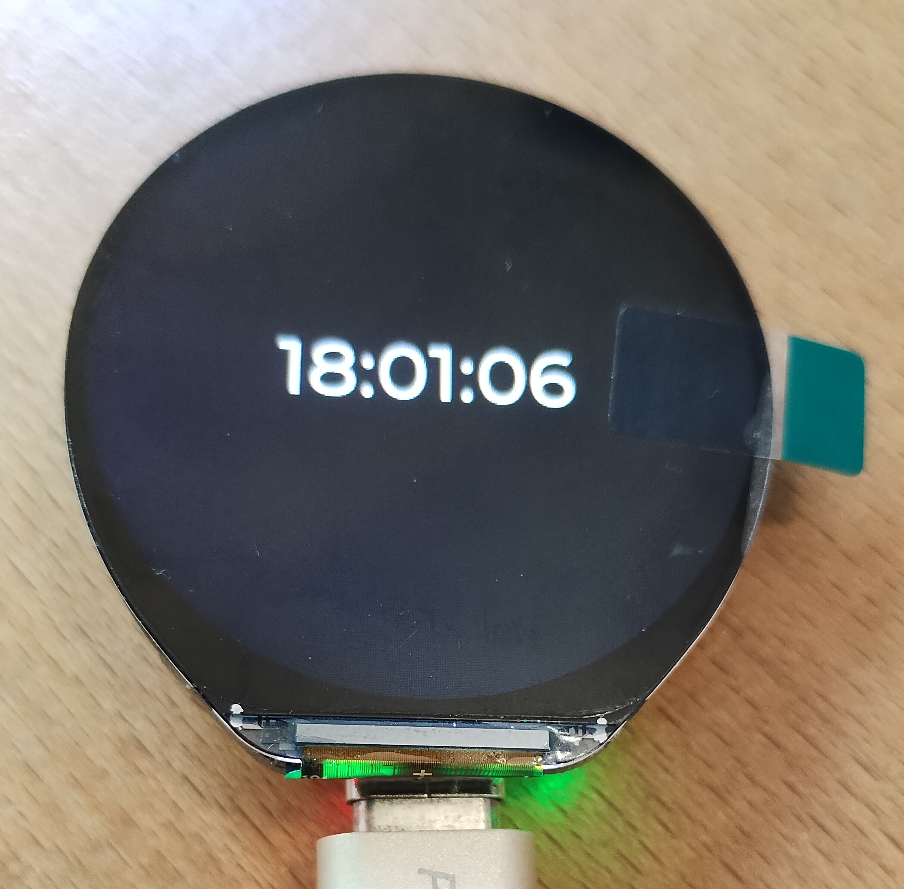

# waveshare-lcd-1.46-touch

Device: https://www.waveshare.com/wiki/ESP32-S3-Touch-LCD-1.46B

Also see the original work that this repo is based on: https://github.com/chickymonkey/waveshare-lcd-1.46-touch

## What is this?

This is a super-simplified version of the above repo, used to demonstrate the screen
working properly on this device, even though (at time of writing) it's not directly
supported by ESPHome. It's not a full application, it's just a demo that shows the
current time on the screen.

I've pulled in a change in one of the forks of the original project (which at time of writing
hadn't made it into a PR to the parent project yet). That means you can use the I2C for multiple
tasks (which the original parent project didn't allow for).

## Why?

This repo serves as a starting point for anyone wanting to make apps on the device.
Rather than starting with a finished app and having to pull things out, here you can
start with very little and work your way up to a full application.

I'd recommend looking at @chickymonkey's work though, as they have used a lot of the
peripherals on the device, so there are some good examples of how to do things there.

## How?

You will need a display device, and you will need to flash this with ESPHome. The first time you do this you will need to plug it in to the machine running ESPHome. After that, you can use remote updates over Wifi. I'm going to assume you know how to get this far, if not, the Internet has lots of guides to help you.

Now you can flash this code to the device:

```
esphome:
  name: clock-1
  friendly_name: clock-1
  on_boot:
    # We don't use touch for this demo, but this initialises it
    # You can see touch updates in the log
    - priority: -100
      then:
        - delay: 300ms
        - lambda: |-
            id(touch_glue).begin();

esp32:
  board: esp32-s3-devkitc-1
  variant: esp32s3
  flash_size: 16MB
  framework:
    type: esp-idf
    version: recommended
    components:
      - name: espressif/esp_lcd_touch_spd2010
        ref: 2.0.0
      - name: espressif/esp_lcd_touch
        ref: 1.2.1
    sdkconfig_options:
      CONFIG_ESP32S3_DEFAULT_CPU_FREQ_240: "y"
      CONFIG_ESP32S3_DATA_CACHE_64KB: "y"
      CONFIG_ESP32S3_DATA_CACHE_LINE_64B: "y"
      CONFIG_ESP32S3_INSTRUCTION_CACHE_32KB: "y"
      CONFIG_SPIRAM_FETCH_INSTRUCTIONS: y
      CONFIG_SPIRAM_RODATA: y
      CONFIG_BT_ALLOCATION_FROM_SPIRAM_FIRST: "y"
      CONFIG_BT_BLE_DYNAMIC_ENV_MEMORY: "y"

# Enable logging
logger:

# Enable Home Assistant API
api:
  encryption:
    key: !secret ha_api_encryption

ota:
  - platform: esphome
    password: !secret esphome_ota_password

wifi:
  ssid: !secret wifi_ssid
  password: !secret wifi_password
  fast_connect: True

  # Enable fallback hotspot (captive portal) in case wifi connection fails
  ap:
    ssid: "clock-1"
    password: "somePassword"

captive_portal:

# This fetches a long sequence of numbers and puts them into $INIT_SEQUENCE
# which we use later on. This avoids having that long sequence of numbers in this
# code file
packages:
  remote_package_shorthand: github://coofercat/waveshare-lcd-1.46-touch/init_sequence.yaml@main

# This pulls in the spd2010_glue touch driver
external_components:
  - source: github://coofercat/waveshare-lcd-1.46-touch@main

# This demo shows the time, so we use this to set the display
# 'label' once every second.
time:
  - platform: homeassistant
    id: homeassistant_time
    on_time:
      - seconds: "*"
        then:
          lvgl.label.update:
            id: clock_display
            text: !lambda return id(homeassistant_time).now().strftime("%H:%M:%S");

psram:
  mode: octal
  speed: 80MHz

# Not strictly needed, but the demo also puts a switch into Home Assistant
# which you can use to turn the backlight on and off
output:
  - platform: ledc
    pin: GPIO5
    id: backlight

light:
  - platform: monochromatic
    id: screen_backlight
    output: backlight
    name: "backlight Light"
    restore_mode: ALWAYS_ON

# This is part of getting the display/touch working
spi:
  id: display_qspi
  type: quad
  clk_pin: GPIO40
  interface: spi2
  data_pins: [GPIO46, GPIO45, GPIO42, GPIO41]

# This is for touch events
i2c:
  scl: GPIO10
  sda: GPIO11
  scan: True

# This is the display initialisation. Most of this probably shouldn't be
# edited unless you know what you're doing
display:
  - platform: qspi_dbi
    model: CUSTOM
    data_rate: 10MHz
    id: main_display
    spi_id: display_qspi
    color_order: rgb
    dimensions:
      height: 412
      width: 412
    cs_pin: GPIO21
    reset_pin: GPIO3
    auto_clear_enabled: false
    update_interval: never
    spi_mode: 0
    draw_rounding: 4
    init_sequence: $INIT_SEQUENCE   # From the package init_sequence.yaml file

# lvgl is the magic that actually draws things on the screen. This is as minimal
# as possible, and just writes a string of text to the middle of the screen.
# The text in the label is updated once per second by the time resource above
# While things are initialising, you'll see the text below on the screen.
# We use one of the lvgl/ESPHome built in fonts to avoid extra complication, but you
# can you your own custom fonts and sizes if you want.
lvgl:
  page_wrap: true
  theme:
    dark_mode: true
  pages:
    - id: main_page
      widgets:
        - label:
            id: clock_display
            align: CENTER
            x: 0
            y: 0
            text: "--:--:--"
            text_font: montserrat_48


# This provides touch events. You can use on_swipe_left/on_swipe_right
# and so on in lvgl to handle touch events.
spd2010_glue:
  id: touch_glue
  width: 412
  height: 412
  int_gpio: 4       # plain integer; we handle GPIO internally
  swap_xy: false
  mirror_x: true
  mirror_y: false

```

Once that's flashed the device should reboot and show you the time. Mine looks like this:



## Miscellaneous

- If you find that you can't get `on_touch` or `on_click` to work on anything that isn't in the
  middle of the screen, try changing `mirror_x` and `mirror_y` around. They don't change where
  LVGL puts the button or text, but they do change where the touch sensitivity goes.
